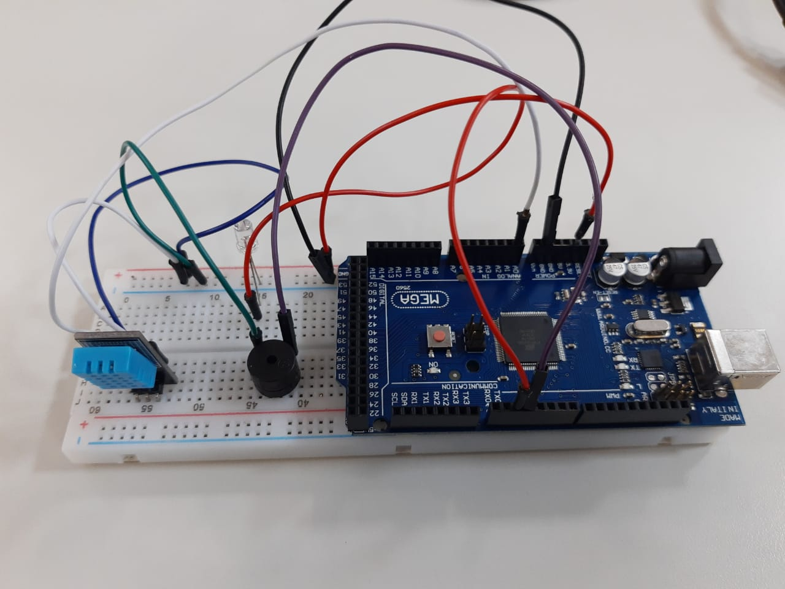
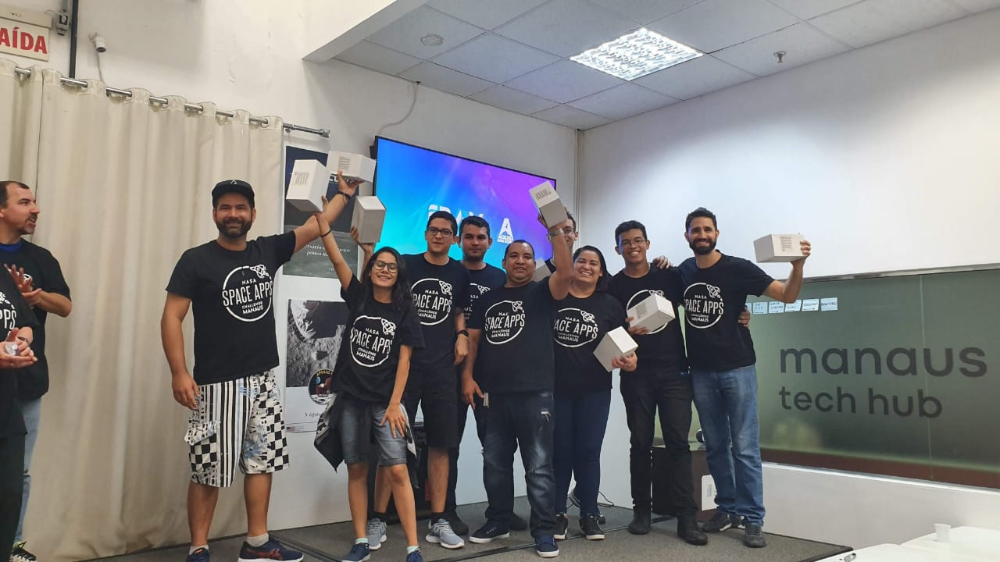

# Repository used to Nasa Hackthon

In this repository has a notebook python and datasets to decide the regions where we should use our hardware to save lifes.

### Arduino Mega

We utilize Arduino Mega with the following components to create a MVP:

* DHT11
* Buzzer
* LED

### Winner Team
our team was the winner of hackathon NASA 2019 Manaus.

**Business analysts**
@ [Claudemiro Freitas](https://www.instagram.com/claudemirofreitas/)
@ [Reiner Freitas](https://about.me/reinierfreitas)

**Designer**
@ [Everson Santiago](http://eversonsantiago.daportfolio.com/)

**Technical Developers**
@ [Carsio Eddyo](http://carsio.dev/)
@ [Everton Lima Aleixo](https://github.com/evertonaleixo)
@ [Gabriel de Oliveira Maciel](https://github.com/medina2001)
@ [Geisiana Mauricio](https://www.linkedin.com/in/geisiana-mauricio-28592131/)
@ [Lucas Mathews](https://github.com/LRaziel)
@ [Raquel Oliveira Vieira](https://www.linkedin.com/in/raquel-vieira-164b2a191/)
